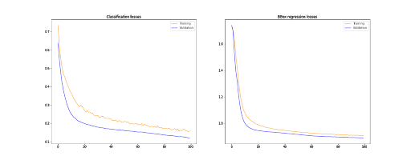

# MTCNN_Implementation
# Implementation of MTCNN on traffic sign detection

## MTCNN overview

MTCNN is originally designed to be an algorithm to solve the problem of face localization. The main
idea of this method is using multiple multi-task cascading neural networks to improve the quality
and accuracy of face detection. The algorithm is divided into 3 stages:

* 1. Stage 0 : The input image will be resized by the same factor multiple times to form an 
  image pyramid
* 2. Stage 1 (P-Net) - Region proposals : The image pyramid will then be fed into P-Net
  to output proposals of region with possible presence of objects.
* 3. Stage 2 (R-Net) - Refinement : The proposed regions will then be fed into R-Net to
  refine the bounding boxes.
* 4. Stage 3 (O-Net) - Output : The objects detected by R-Net will then be described in 
  more details by O-Net by facial landmark detection.

## Applications of MTCNN in traffic sign detection
This repository is created to prove that MTCNN does not have only one application. It is a robust
method which can be applied to a wide range of problems and traffic sign detection is one among 
them. This repository employs several changes as compared to the original MTCNN [paper](https://arxiv.org/abs/1604.02878)

* 1. Instead of using MSE for bounding box regression, this repository employs Generalized Intersection
  over Union (GIoU) to achieve more accurate bounding box prediction.
  
* 2. In stage 1 (P-Net) of MTCNN, instead of retrieving region proposal using bounding box regression,
  I ran P-Net throughout the whole image to retrieve the confidence map. Then the regions proposed
  will be attained by finding contours or image segmentation algorithm like Watershed.
* 3. For P-Net and R-Net, the classification will only indicate objectness score instead of specific
  classes. Classification of objects will only be handled by O-Net in the last stage.

## Demo
### Stage 1 (P-Net)
Regions proposal will be done by segmenting the confidence map

### Stage 2 (R-Net)
Those regions will be refined so that it covers the object more neatly 

### Stage 3 (O-Net)
Finally, O-Net further refines the bounding boxes and perform classification 

## Training results
### PNet
{ width=100% }

### RNet

### ONet

